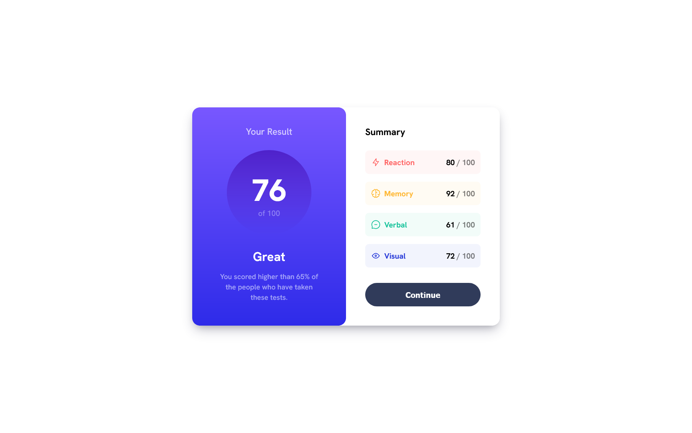
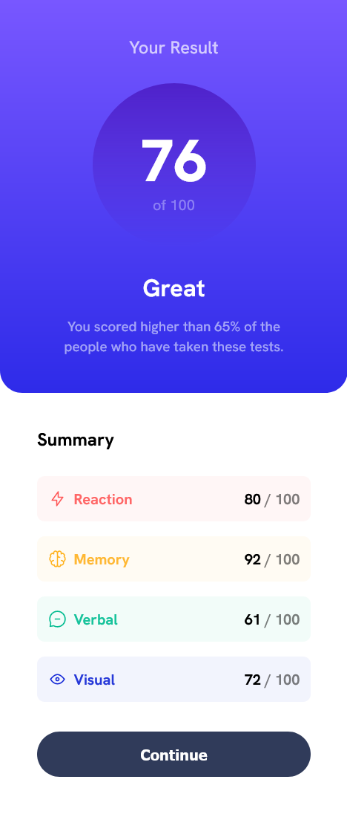

# Frontend Mentor - Results summary component solution

Frontend Mentor challenges help you improve your coding skills by building realistic projects.

## Table of contents

- [Overview](#overview)
    - [The challenge](#the-challenge)
    - [Screenshots](#screenshots)
- [My process](#my-process)
    - [Built with](#built-with)
    - [What I learned](#what-i-learned)
    - [Useful resources](#useful-resources)
- [Author](#author)

## Overview

### The challenge

Users should be able to:

- View the optimal layout for the interface depending on their device's screen size
- See hover and focus states for all interactive elements on the page

### Screenshots

## My process

### Built with

- Semantic HTML5 markup
- CSS custom properties
- Flexbox
- CSS Grid
- Mobile-first workflow
- JavaScript Fetch API

### What I learned

Using HSLA to play with the color transparency, adding a beautiful glassy effect.
 
Using a mobile-first approach
 
The ancient art of centering divs
 
Using the Javascript fetch API

### Useful resources

- [Box Shadow](https://getcssscan.com/css-box-shadow-examples) - This is a very useful box-shadow picker.
- [Centering](https://moderncss.dev/complete-guide-to-centering-in-css/) - This covers everything about centering a div.

## Author

- GitHub - [YounesMakhlouf](https://github.com/YounesMakhlouf)
- Frontend Mentor - [@yourusername](https://www.frontendmentor.io/profile/YounesMakhlouf)